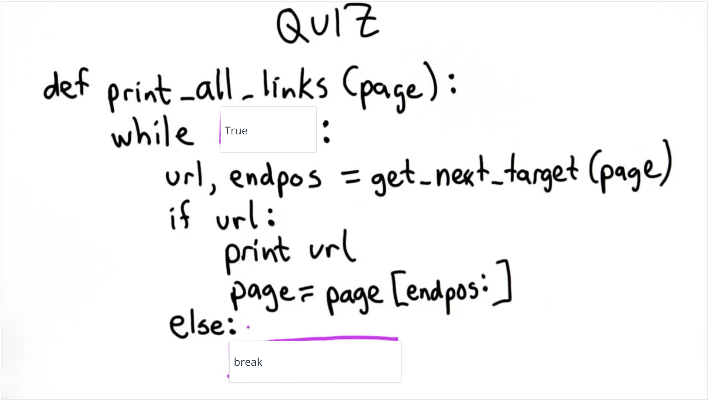

## Quiz 22: Print All Links



A: Here is what the finished code should look like:
```python
def print_all_links(page):
  while True:
    url, endpos = get_next_target(page)
    if url:
      print(url)
      page = page[endpos:]
    else: 
      break
```
