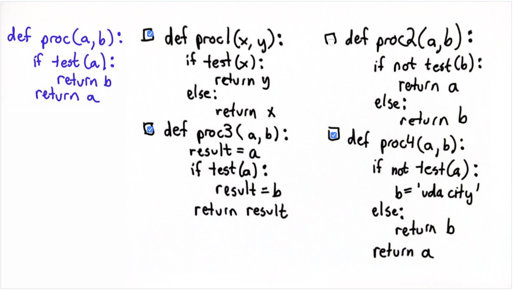

## Quiz 2: Proc



A: The following choices are correct:

```python
def proc1(x, y):
  if test(x):
    return y
  else:
    return x
```

```python
def proc3(x, y):
  result = a
  if test(a):
    result = b
  return result
```

```python
def proc4(x, y):
  if not test(a):
    b = 'udacity'
  else:
    return b
  return a
```
