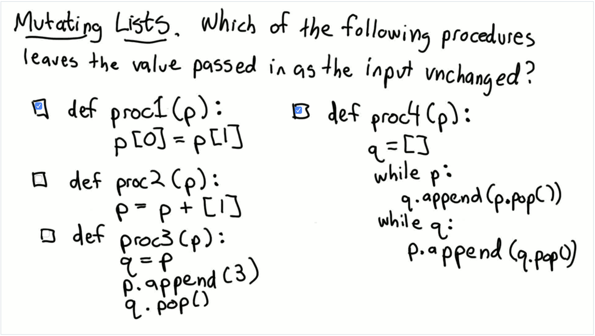

## Quiz 2: Mutating Lists



A: The following answers are correct:

```python
def proc1(p):
  p[0] = p[1]
```

```python
def proc4(p):
  q = []
  while p:◊
    q.append(p.pop())
  while q:
    p.append(q.pop())
```
