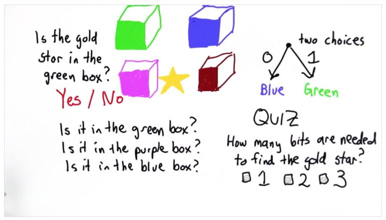

## Quiz 8: Bits



A: We actually only need two questions (two if-else layers) to figure out which box the star is in, therefore we only need two bits to find the gold star:

```python
# First layer question
if gold_star in (green or purple):
  # Second layer question
  if gold_star in green:
    return green
  else:
    return purple
else:
  if gold_star in blue:
    return blue
  else:
    return red
```
