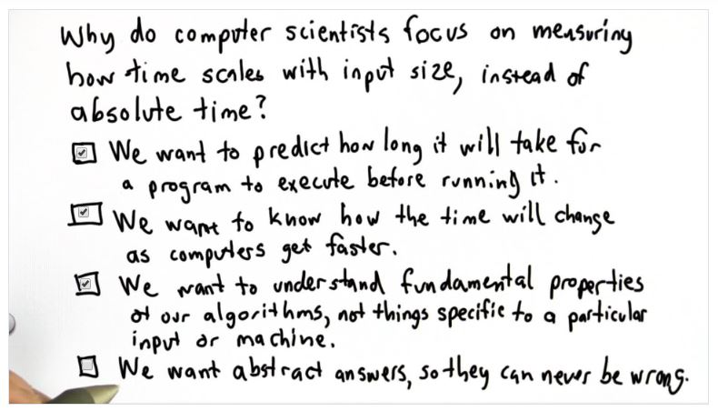

## Quiz 1: Measuring Speed

A: The answer is the first three options, we don't want abstract answers so they can never be wrong, rather we want abstract answers so we can come up with a general case
