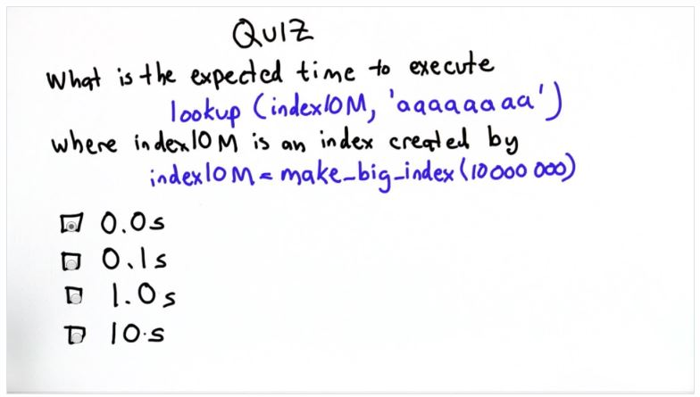

## Quiz 4: Lookup Time



A: About 0.0 seconds based on the code provided, the word we are trying to lookup appears at the beginning of the index:

```python
def make_big_index(size):
    index = []
    letters = ['a', 'a', 'a', 'a', 'a', 'a', 'a', 'a']
    while len(index) < size:
        word = make_string(letters)
        add_to_index(index, word, 'fake')
        for i in range(len(letters) - 1, 0, -1): 
            if letters[i] < 'z':
                  letters[i] = chr(ord(letters[i]) + 1)
                  break
            else:
                   letters[i] = 'a'
    return index
```
