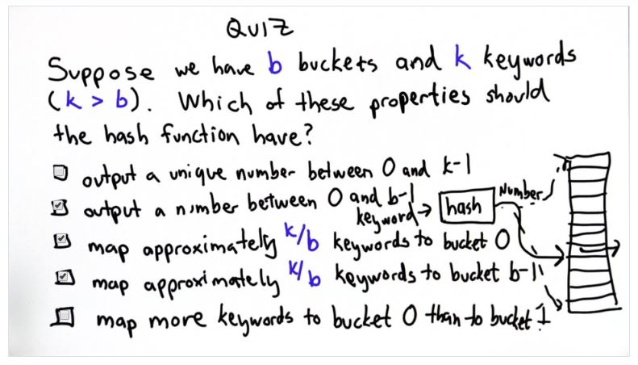

## Quiz 7: Hash Table

A: Choices 2-4 are valid answers, 
* We want the hash function to output a number between 0 and b-1 (bucket index)
* We also want the hash function to map a fraction of the keywords to bucket 0 and another fraction to bucket b-1
