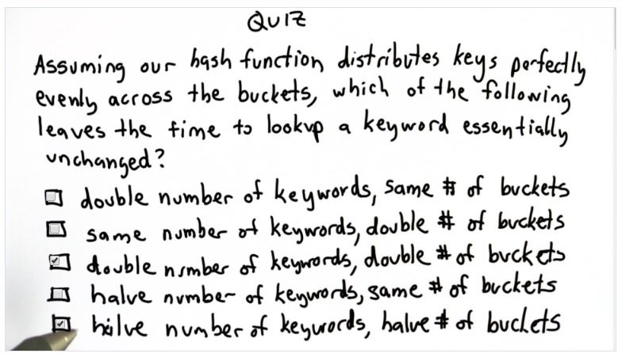

## Quiz 12: Keywords and Buckets

A: If we double the number of keywords and buckets, the ratio of (keywords/buckets) remains unchanged, similarly if we halve the number of keywords and buckets the ratio also remains the same
