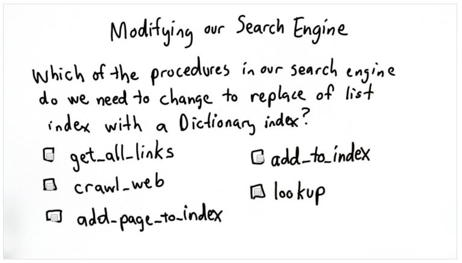

## Quiz 21: Modify the Search Engine



A: We can convert *crawl_web(), add_to_index(), and lookup()* to use a dictionary, the methods are highlighted below:

```python
def crawl_web(seed):
    tocrawl = [seed]
    crawled = []
    index = []
    while tocrawl:
        page = tocrawl.pop()
        if page not in crawled:
            content = get_page(page)
            add_page_to_index(index, page, content)
            union(tocrawl, get_all_links(content))
            crawled.append(page)
    return index

def add_page_to_index(index, url, content):
    words = content.split()
    for word in words:
        add_to_index(index, word, url)

def add_to_index(index, keyword, url):
    for entry in index:
        if entry[0] == keyword:
            entry[1].append(url)
            return
    # not found, add new keyword to index
    index.append([keyword, [url]])

def lookup(index, keyword):
    for entry in index:
        if entry[0] == keyword:
            return entry[1]
    return None
```
