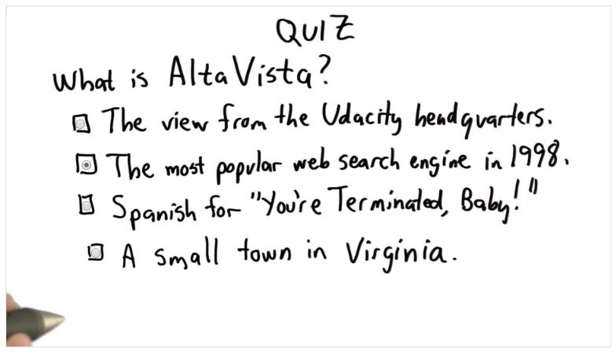

## Quiz 12: AltaVista

A: According to wiki:

> AltaVista was a Web search engine established in 1995. It became one of the most-used early search engines, but lost ground to Google and was purchased by Yahoo! in 2003, which retained the brand but based all AltaVista searches on its own search engine. On July 8, 2013, the service was shut down by Yahoo! and since then, the domain has redirected to Yahoo!'s own search site.
